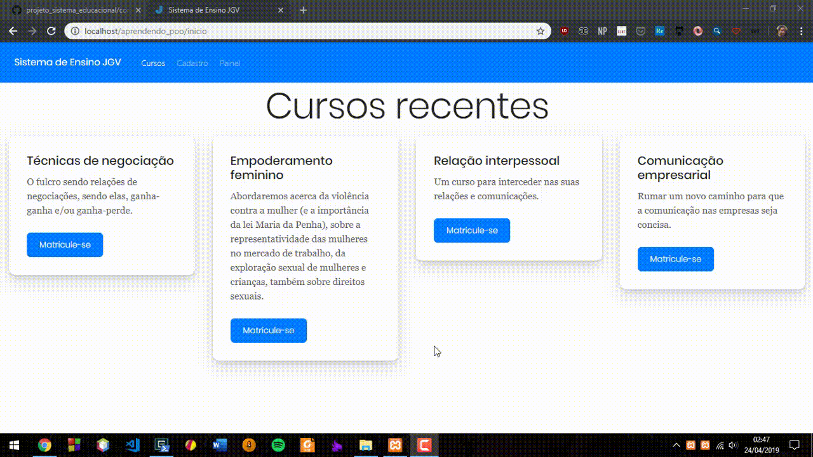

# Projeto Sistema Educacional

**Em construção**, o mesmo visa ser uma plataforma de publicação de cursos interna.

### Demonstração

### Tecnologia empregada

Montado sob o padrão arquitetural de software,  MVC, junto do framework (PHP) de roteamento Slim v3 para urls amigáveis, API Fetch de Javascript para requisição na parte de cadastro, PHP POO no servidor e outros frameworks, tanto de CSS (Bootstrap, Shards), quanto de Javascript (Shards) para a estilização.